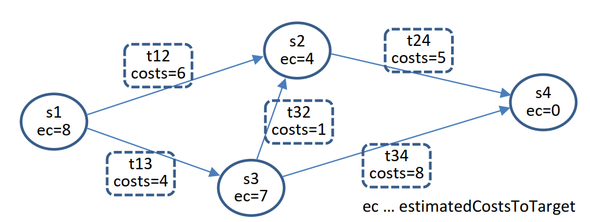
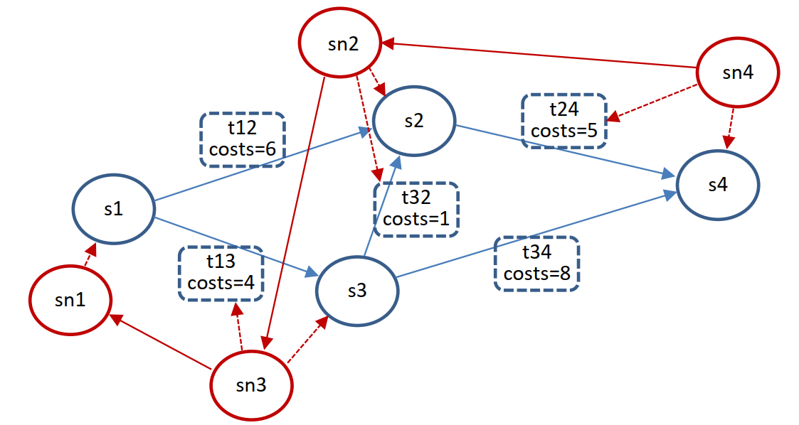
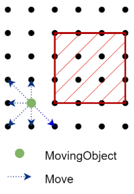
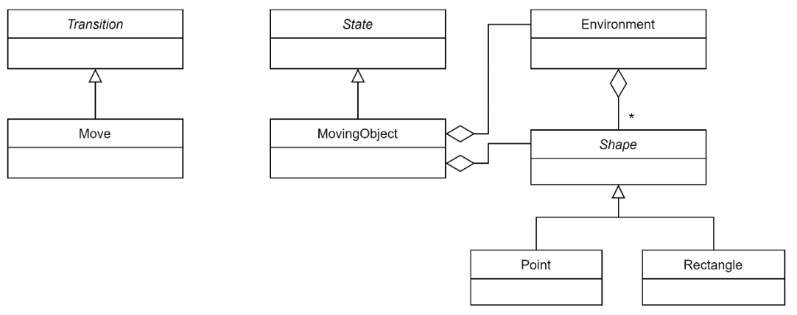
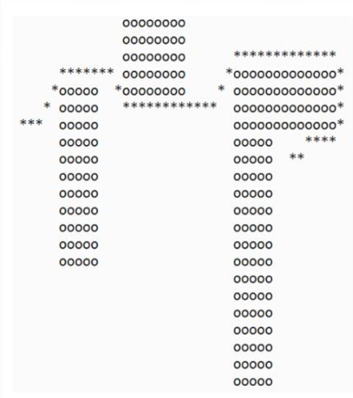

[](https://classroom.github.com/a/iWFP4DH0)
# SWE4-Übungen - SS 2024 - Übung 4

## 1. Pfadsuche mit dem A*-Algorithmus (src/pathfinder)

In vielen industriellen Einsatzbereichen findet Pfadsuche Anwendung. Dabei geht es darum, einen
Pfad für einen Roboter zu finden, der es ihm ermöglicht, sich von einem Startpunkt zu einem Zielpunkt zu bewegen, wobei Hindernisse umgangen werden müssen. Eine Möglichkeit, dieses Problem zu lösen, ist Backtracking. Allerdings wird bei Anwendung dieses Verfahrens der Suchraum sehr groß, was zu nicht vertretbaren Rechenzeiten führt. Ein effizienter Algorithmus zur Lösung dieses Problems ist der sogenannte A*-Algorithmus, der von Peter Hart, Nils Nilsson und Bertram Raphael bereits 1968 entwickelt wurde. Eine übersichtliche Darstellung des Algorithmus findet man beispielsweise auf der englischen Wikipedia unter https://en.wikipedia.org/wiki/A*_search_algorithm. Der A*-Algorithmus wird oft zur Wegsuche bei Routenplanern eingesetzt. Er ist aber auch auf die hier angeführte Problemstellung anwendbar.

Die Grund A*-Algorithmus enumeriert grundsätzlich auch alle möglichen Lösungsvarianten, allerdings versucht er, zunächst den erfolgversprechendsten Weg zum Ziel zu verfolgen. Erst dann werden weitere Varianten untersucht. Findet der Algorithmus auf diese Weise bereits frühzeitig eine Lösung, müssen viele Lösungsvarianten erst gar nicht evaluiert werden. Damit der Algorithmus beim Durchwandern des Lösungsraums in die erfolgversprechendste Richtung weitergehen kann, benötigt er eine Abschätzung der Kosten, die auf dem verbleibenden Weg zum Ziel anfallen werden. In unserer Problemstellung kann für diese Kostenfunktion `h(x)` die euklidische Distanz herangezogen werden. Wenn `g(x)` die Kosten von der Ausgangskonfiguration bis zur Konfiguration x bezeichnet, stellt `f(x) = g(x) + h(x)` eine Abschätzung der Kosten von der Ausgangs- zur Zielkonfiguration dar, wobei der Weg zum Ziel über x verläuft.

Gehen Sie bei der Implementierung der Aufgabe testgetrieben vor. Implementieren Sie die nachfolgend angeführten Klassen Methode für Methode und geben Sie für jede Methode zumindest einen einfachen Testfall an. Erstellen Sie zunächst nur den Methodenrumpf mit einer Standardimplementierung, die nur syntaktisch korrekt sein muss. Implementieren Sie dann für diese Methode die Unittests, deren Ausführung zunächst fehlschlagen wird. Erweitern Sie anschließend die Implementierung der Methode so lange, bis alle Unittests durchlaufen. Erst wenn die Methoden-bezogenen Tests funktionieren, können Sie komplexere Tests erstellen.

Eine Testsuite mit einigen Tests wird Ihnen auf der E-Learning-Plattform zur Verfügung gestellt. Erweitern Sie diese Testsuite so wie beschrieben. Ihre Implementierung muss die vorgegebenen und die von Ihnen hinzugefügten Tests bestehen. Die Implementierung des Algorithmus soll völlig unabhängig von einer konkreten Anwendungsdomäne sein. Dies kann gewährleistet werden, indem die Implementierung ausschließlich von den nachfolgend angeführten Interfaces `State` und `Transition` abhängig ist. Mit Implementierungen dieser beiden Interfaces kann ein Zustandsgraph definiert werden, in dem der A*-Algorithmus den optimalen Weg vom Start- zum Zielknoten suchen kann. State-Objekte repräsentieren Zustände im Graphen, die über Transition-Objekte miteinander verbunden sind.

<div align="center">
  
</div>

```java
package swe4.astar;
  // Repräsentiert den Zustand eines Knotens im Suchraum. Dieser ist über
  // Transitionen mit seinen Nachbarzuständen verbunden. Auf diese Weise
  // wird ein Zustandsgraph aufgespannt.
  public interface State {

  // Überprüft, ob dieser Zustand gleich dem Zustand other ist.
  @Override
  boolean equals(Object obj);

  // Notwendig für Verwendung in Hash-basierten Behältern.
  // Muss mit equals kompatibel sein:
  // state1.equals(state2) => state1.hashCode() == state2.hashCode()
  @Override
  int hashCode();

  // Liste der Zustandsüberführungen, mit denen man von diesem Zustand in
  // die unmittelbar anschließenden Zustände gelangt.
  List<? extends Transition> transitions();

  // Retourniert den Knoten, der durch Anwendung der Zustandsüberführung
  // transition auf diesen Zustand entsteht.
  <S extends State> S apply(Transition transition);

  // Geschätzte Kosten zum Erreichen des Zielzustands. Werden diese immer
  // unterschätzt, ermittelt der A*-Algorithmus die minimale Lösung.
  double estimatedCostsToTarget();
} 

// Repräsentation einer Zustandsüberführung. Jeder Zustand hält eine Liste
// von Transitionen, über die man zu den Nachbarzuständen gelangen kann.
public interface Transition {
  // Tatsächliche Kosten für diese Zustandsüberführung
  double costs();
}
```

**a.** Zur Implementierung des A*-Algorithmus benötigen Sie die Hilfsklasse `SearchNode`. Damit kann man den Weg von einem SearchNode zum Startknoten zurückverfolgen, da dieser mit seinem Vorgängerkonten verkettet ist. Ein `SearchNode` kennt die Kosten vom Startknoten bis zu ihm selbst. Ein `SearchNode` kann auch eine Schätzung für den Weg zum Zielknoten und damit eine Schätzung für die Gesamtkosten vom Start- bis zum Zielknoten berechnen.

<div align="center">
  
</div>

```java
package swe4.astar;

// SearchNode ist eine Hilfsklasse, die zur Implementierung des A*-Algorithmus
// benötigt wird. Damit kann man den Weg von einem SearchNode zum Startknoten
// zurückverfolgen, da dieser mit seinem Vorgängerkonten verkettet ist. Ein
// SearchNode kennt die Kosten vom Startknoten bis zu ihm selbst. SearchNode
// kann auch eine Schätzung für den Weg zum Zielknoten berechnen.
public class SearchNode implements Comparable<SearchNode> {

  // Suchknoten mit dem Zustand state und dem Zielzustand target initialisieren.
  // Es existiert kein Vorgängerknoten.
  public SearchNode(State state , State targetState);

  // Suchknoten mit dem Zustand state und dem Zielzustand target initialisieren.
  // predecessor ist der Vorgängerknoten, von dessen Zustand man mit transition
  // zum Zustand dieses Knotens kommt.
  public SearchNode(State state, SearchNode predecessor, Transition transition);

  // Gibt Zustand dieses Knotens zurück.
  public State getState();

  // Gibt den Vorgängerknoten zurück.
  public SearchNode getPredecessor():

  // Setzt die Referenz auf den Vorgängerknoten.
  public void setPredecessor(SearchNode predecessor);

  // Gibt Transition zurück, die Vorgängerknoten in diesen Knoten überführt.
  public Transition getTransition();

  // Setzt Transition, die Vorgängerknoten in diesen Knoten überführt.
  public void setTransition(Transition transition):

  // Gibt Kosten vom Startknoten bis zu diesem Knoten zurück.
  public double costsFromStart();

  // Setzt die Kosten vom Startknoten bis zu diesem Knoten.
  public void setCostsFromStart(double costsFromStart);

  // Gibt geschätzte Kosten von diesem Knoten bis zum Zielknoten zurück.
  public double estimatedCostsToTarget();

  // Gibt Schätzung der Kosten vom Startknoten über diesen Knoten bis zum
  // Zielknoten zurück (= Kosten bis zu diesem Knoten + geschätzte Kosten
  // bis zum Zielknoten).
  public double estimatedTotalCosts();

  // Gibt zurück, ob dieser Knoten und der Knoten other denselben Zustand
  // repräsentieren.
  // Vorsicht: Enthaltenen Zustand per Wert, vergleichen, nicht die Referenzen.
  // Muss konsistent mit compareTo implementiert werden:
  // a.equals(b) <==> a.comparesTo(b) == 0.
  @Override
  public boolean equals(Object obj);

  // Notwendig für Verwendung in Hash-basierten Behältern. Muss konsistent
  // mit equals implementiert werden: a.equals(b) => a.hashCode() == b.hashCode.
  @Override
  public int hashCode();

  // Vergleicht zwei Knoten auf Basis der geschätzten Gesamtkosten.
  // <0: Kosten dieses Knotens sind kleiner oder gleich als die Kosten von other.
  //  0: Dieser Knoten und other sind gleich (referenzieren den gleich Zustand).
  // >0: Kosten dieses Knotens sind höher als Kosten von other.
  @Override
  public int compareTo(SearchNode other);

  // Extrahiert aus der Knotenliste, die bei diesem Knoten ihren Ausgang hat,
  // die Liste von Transitionen. Da der Weg in umgekehrter Reihenfolge
  // gespeichert ist, muss die Transitionsliste invertiert werden.
  public List<? extends Transition> getTransitionsFromStart();
}
```

**b.** Implementieren Sie darauf aufbauend den A*-Algorithmus in der Klasse `AStarSolver`. Verwenden Sie bei Ihrer Lösung so weit wie möglich die Behälterklassen des JDK. Setzen Sie insbesondere bei der Implementierung des A*-Algorithmus eine Prioritätswarteschlange (`PriorityQueue`), für die Speicherung der Liste der offenen Knoten eine sortierte Menge (`Set`) und für die Zuordnung von Zuständen zu Suchknoten einen assoziativen Behälter (`Map`) ein.

```java
public class AStarSolver {

  // Berechnet eine kostenoptimale Folge von Transitionen, welche den gegebenen
  // Anfangszustand initialState in den Zielzustand targetState überführt.
  // Wirft NoSolutionException (Checked Exception), falls es keine derartige
  // Folge von Transitionen gibt.
  public List<? extends Transition> solve(State initialState, State targetState)
                                    throws NoSolutionException;
}
```

**c.** Implementieren Sie auf Basis des in a. und b. entwickelten A*-Algorithmus einen Pfadsuch-Algorithmus,der für punktförmiges Objekt den kürzesten Weg von einem Start- zu einem Zielpunkt findet. Das Objekt darf auf keinem Pfadpunkt mit einem Hindernis kollidieren. Alle geometrischen Objekte können auf ein ganzzahliges Koordinatensystem abgebildet werden. Nachstehend sind einige Hinweise angeführt, wie Sie diese Anforderungen implementieren können.

* Erstellen Sie eine Klasse `Environment` zur Repräsentierung der Hindernisse. Ein Hindernis wird als achsenparalleles Rechteck (`Rectangle`) modelliert. Es können beliebig viele Hindernisse definiert werden.

<div align="center">
  
</div>

* Die Klasse `Move` beschreibt die Bewegung eines geometrischen Objekts um ein Inkrement (das Objekt wird um eine Einheit in xund/oder y-Richtung verschoben). Move implementiert das Interface `Transition`.

* Die Klasse `MovingObject` repräsentiert das Objekt, das sich durch die Umgebung bewegt. Es wird als Punkt (`Point`) modelliert und implementiert das Interface `State`. `MovingObject` liefert eine Liste von `Moves`, die angeben, in welche Richtung sich das Objekt bewegen kann, ohne mit einem Hindernis zu kollidieren.

* Die geometrischen Objekte erben von der abstrakten Basisklasse `Shape`. So wird Ihr Programm einfach erweiterbar. Implementieren Sie für alle Shapes eine Methode, mit welcher ermittelt werden kann, ob zwei geometrische Objekte miteinander kollidieren. Für diese Aufgabenstellung ist es ausreichend, wenn Sie überprüfen können, ob ein Punkt mit einem Rechteck zusammenstößt.

Folgendes Klassendiagramm fasst die Designüberlegungen zusammen:

<div align="center">
  
</div>

Wenn Sie alle diese Klassen korrekt implementiert haben, wird der A*-Algorithmus das Pfadsuch-Problem lösen.

**d.** Erweitern Sie Ihre Test-Suite um Tests, welche die Korrektheit der für die Implementierung des Pfadsuch-Algorithmus erforderlichen Klassen überprüfen. Ergänzen Sie Ihre Klassen um Methoden, mit denen von einer Umgebung mit Hindernissen und einem Pfad ein einfacher ASCII-Plot erstellt werden kann (so wie in der folgenden Abbildung).

<div align="center">
  
</div>

Implementieren Sie ein Hauptprogramm, in dem Sie den kürzesten Weg für verschiedene Umgebungen ermitteln.Berücksichtigen Sie in Ihrem Programm auch die nebenstehend dargestellte Umgebung.

Geben Sie dem Testen in dieser Übung einen besonderen Stellenwert. Im Zuge des Feedbacks müssen Sie Ihre Testsuite, welche die Korrektheit der Implementierung des A*-Algorithmus überprüft
(Teilaufgaben a. und b., auch auf die Implementierung Ihres Feedback-Partners anwenden. HaltenSie sich daher auch genau an die vorgegebenen Schnittstellen. Die Höhe des Erfüllungsgrads für den
Teilbereich Testen hängt primär vom Umfang und von der Qualität der von Ihnen selbst entwickelten Unit-Tests ab.
