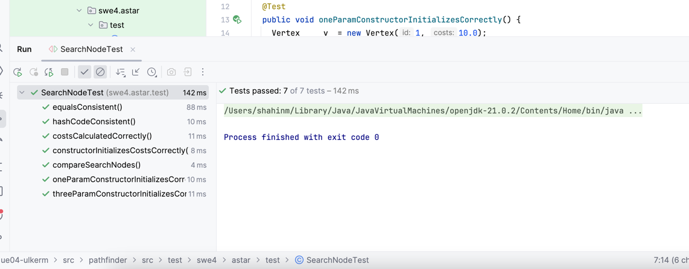
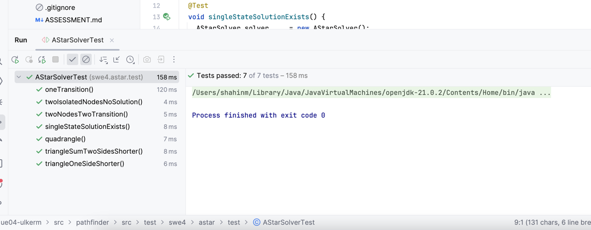
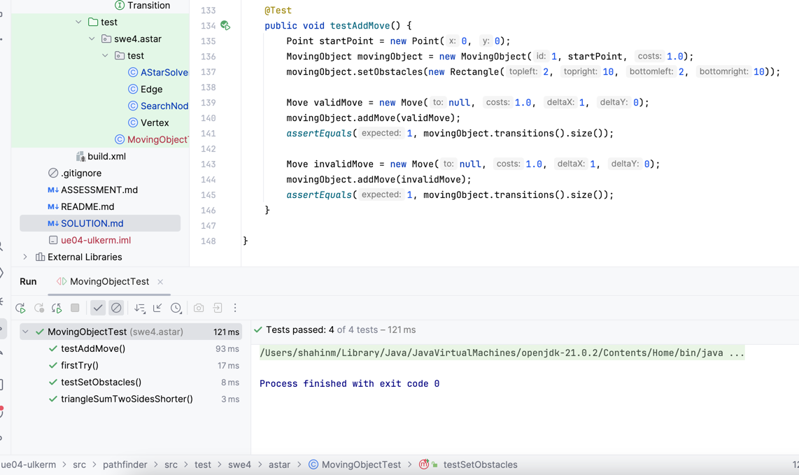

# Übung 4 - Lösung

## 1. Pfadsuche mit dem A*-Algorithmus (src/pathfinder)

### Lösungsidee

Es wird bei der Implementierung des A*-Algorithmus eine Prioritätswarteschlange (PriorityQueue), map und eine Menge (Set) verwendet. Searchnode wird in openlist und in connections(falls diese zustand in map nicht existiert) hinzufügt. Wenn openLIst nicht leer ist, wird eine loop startet und dauert solange openlist nicht leer ist. Es wird SearchNode mit der kleinsten Kostensumme entnimmt. Dann wird geprüft ob das entnommene Element der Zielknoten ist. Wenn ja, dann wird methode solve() die Liste von Transtions von diesem element(getTransitionsFromStart()) geliefert. Andersfalls werden alle Nachbarknoten des entnommenen Elements, die sich noch in der openlist befinden, betrachtet.

Es wird ein Objekt (Point mit koordinaten) erstellt und das Objekt wird um eine Einheit in x und/oder y-Richtung verschoben. Es wird mit jedem move geprüft ob Objekt mit mit einem Hindernis kollidiert oder nicht. Ein Hindernis wird als Rechteck (Rectangle) modelliert.
Ich habe einige JUnit tests erstellt und getestet, z.b ob addMove funktioniert richtig oder nicht, erkennt Rectangle oder nicht.

### Testfälle
SearchNodeTest:

AStarSolvertest:

MovingObjectTest:

